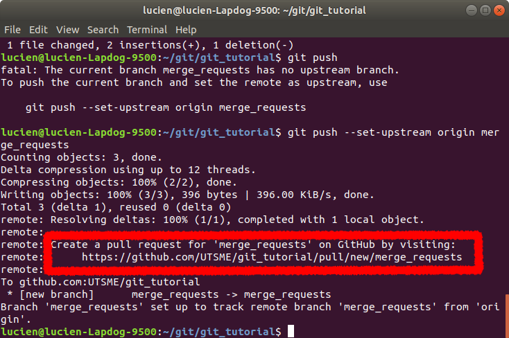
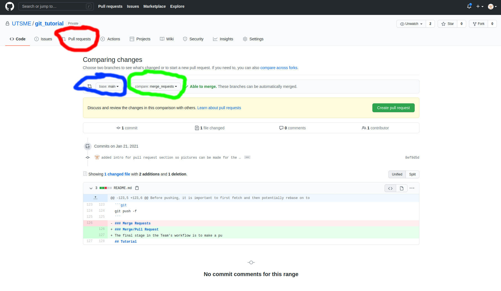
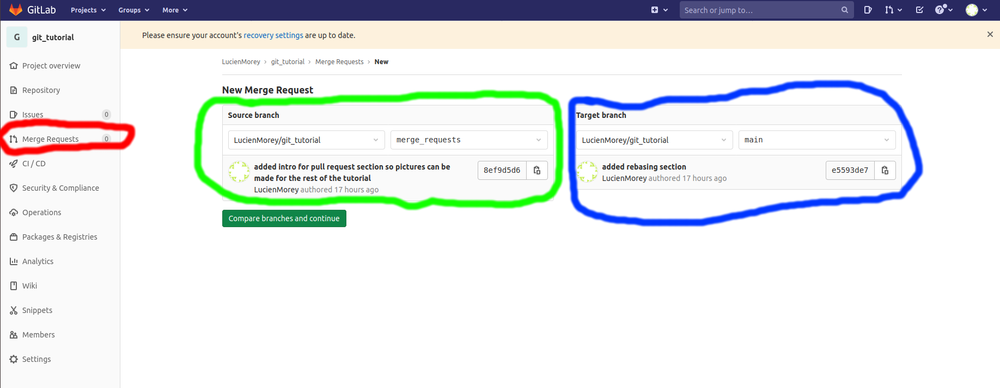

# git_tutorial
tutorial on how to conform to the UTS Motorsports git workflow

## Notes
* ssh vs http
* gitk for visual tool
* this tutorial will teach usage around the git bash api, you will be expected to follow and meet rules if you select to use another method of controlling git.
* On windows you will be required to install git bash seperately but on macos and linux you can check the installation of git through command git -h and you should see the help page for using git. if it does not appear then you can install git with a sudo apt install git

## Usage
### Cloning
To begin, you are required to clone down a version of this repoitory. This can be done with either the http or ssh protocal, see above for help setting up an ssh key for your machine. THe following outline the syntax for each protocal

SSH
```git
git clone git@github.com:<GITHUB_USER>/<REPOSITORY_NAME>
```

HTTP
 ```git
git clone https://github.com/<GITHUB_USER>/<REPOSITORY_NAME>
```
THis will create a new directory in your current working directory containing the main/master branch of the upstream repository. change into the repository directory to begin usign git properly.

### Branches
All work is done on branches. By default, you will have a main or master branch depending on when the repository was created (main is now default since 2020). Work should never be done on your master/main because that is where all finished code will end up and ideally this branch will be not be writeable when you try to push code to upstream.

A new branch can be created and then automatically switched to with the following command:
```git
git checkout -b <NAME_OF_BRANCH>
```
The new branch will begin as a carbon copy of the current working branch, ie the latest commit of your previous working branch.

A slightly more complex use case of branch creation is employed when retrieving a prexisting branch from upstream. the following command will create a local branch and set it to track the remote branch upstream to avoid entering a detatched head state.
```git
git checkout -b <NAME_OF_BRANCH> <UPSTREAM_REMOTE_NAME>/<UPSTREAM_BRANCH_NAME>
```
To switch between existing branches, you can use the checkout command without the addition al -b argument like shown below:
```git
git checkout <NAME_OF_BRANCH>
```
To delete a branch locally after it has been merged into master sucessfully use the following command:
```git
git checkout -D <NAME_OF_BRANCH>
```
After a Branch has been deleted locally it can be deleted upstream as well from the terminal with
```git
git push origin :<NAME_OF_BRANCH>
```
the upstream version of a branch can also be deleted on Github or Gitlab after merging

### Making Commits
After completing work you need to make a commit as a form of formal save point in your development cycle. It is important to commit often so that is easy to revert back to earlier states without losing huge amounts of work. making a commit is done in two stages; the first is to stage the appropriate files and the second is to actually make a commit and leave a brief message describing your changes.

The first step in making a commit is to stage files. staging is done with the git add command and follows standardised file slection protocal, ie using the * character to indicate all files that follow a naming pattern. some examples are shown below.

Adding a single file.
```git
git add path/to/file/file.txt
```
Adding a folder.
```git
git add path/to/folder
```
Adding files that follow a specific convention. The first example will add all the .c files within the current directory. The second example will add all the file types called name.
```git
git add *.c
git add name.*
```
Files can also be unstaged if staged accidentally with the following command. It follows the same naming pattern usage as adding a file.
```git
git reset HEAD file_to_unstage.txt
```
At any time changes to files can be discarded with the checkout command. If instead of checking out a branch name and switching branches, you specify the path to a file then all of the local changes made will be automatically discarded. An example is shown below.
```git
git checkout path/to/file/file.txt
```
Finally, once all the appropriate files have been staged, a commit can be made. this is done with the format shown below.
```git
git commit -m "commit message"
```
the -m tag is shown here for ease and is not required but the terminal will open a nano or vim text editor instance for specifying a commit message which is not an intuitive interface for beginners.

### Fetching and Pulling
After an initial clone has been created the way to get additional new changes is with either the fetch command or the pull command. the difference between the two is that pulling will automatically grab and then merge any changes obtained from upstream into your local branch if it is possible. these commands are shown below
```git
git fetch
git pull
```
this version of the command will fetch or pull all upstream branches. You can optionally add arguements to get a specific branch from a specific remote. Again, most of the time in the UTS Motorsports workflow you should be working with the origin remote. syntax for this alternate version of the commands is shown below
```
git fetch <REMOTE_NAME> <BRANCH_NAME>
git pull <REMOTE_NAME> <BRANCH_NAME>
```
fetching will download changes and place them in a remote local branch. before working with fetched code it is important to checkout a new branch and make the branch point to this code to avoid entering a detached head state.

In both situations it is important to be aware of potential merge conflicts. These can occaionally occur when multiple people work on same files and use the same lines in a file for their implementation. git will recognise this state for you and alert you when you try to pull or when you attempt to merge/rebase after fetching. If this happens then in each of the conflicting files there will be lines flagged with the conflicting code and you will have the option to manually select which changes you want to keep. It is possible to keep current changes, incoming changes or a combination of both depending on the situation. Be sure to ask other team members if you arent sure because you dont want to accidentally delete someone else's code.

### Rebasing
the core purpose of rebasing is to change your commit history to suit your purposes. Some of the reasons for rebasing are as follows:
- Someone has merged in code to master while you were developing your own code and now the upstream master has divereged from your local master. Rebasing will play all of the changes you have made on top of the upstream changes assuming there are no merge conflicts so that you can create a merge request without issue.
- Squashing commits so that they are more representative of atomic functional changes instead of having lots of random formatting or bug fixing commits.
- changing multiple commit messages at once so that they do a better job outlining the changes you have made and for what reason.

The simplest form of rebasing can be triggered with the following command. This will cover the first usecase where your changes will be played back on top of a diverged master so that meging is possible.
```git
git rebase <BRANCH_NAME>
```
A more complex version of rebasing called an interactive rebase exists as well for all the other potential use cases of this functionality. This requires some reading and a good tutorial to explain how to use this functionality can be found here https://thoughtbot.com/blog/git-interactive-rebase-squash-amend-rewriting-history

### Pushing
Pushing it required to get all your changes onto an upstream branch. It will not work unless changes have been commited before attempting to push or no changes will be registered as existing. It can be done simply with the following command.
```git
git push
```
This will push to the upstream version of a branch automatically unless it does not yet exist. In this case the following version of the command is required.
```
git push --set-upstream <REMOTE_NAME> <BRANCH_NAME>
```
in most situations if you are following the teams workflow then your <REMOTE_NAME> will be origin. This will change when trying to push to other forks but that will not be covered in this workflow.

Before pushing, it is important to first fetch and then potentially rebase on top of changes. Without first fetching and then rebasing off potential upstream changes, you run the risk of allowing history to diverge and as a consequence. This will cause you problems either immediately as your attempt to push is rejected due to diverging history or when you attempt to make a merge request and you find the same issue. It is possible to force push and override changes anyway but this should only be used if you have already rebased and the reason for failure is the addition of additional commits that were not there before. The consequence of a bad force push can be loss of work. the force push command is outlined below
```git
git push -f
```
### Merge/Pull Request
The final stage in the Team's workflow is to make a pull request. At this stage your completed code should exist on an upstream branch ready to be merged into master, ie matching history up until now and merge conflict free. A merge request is made from either Github or Gitlab depending one which one is currently in use.

There are 2 different ways to easily create a pull request when using Gitlab or Github. The shared method between the two is to use the automatically generated link when pushing to an upstream branch. The second way is to go to the website and to select the merge/pull requests tab and manually select the source and base branches for merging. Pictures have been attached to indicate how a pull request can be created.

#### Terminal Method
The automatically generated link is highlighted in in a box. Copying this link and pasting it into a browser window will automatically lead you to a pull request merging the current working branch into master.



#### Github Method
When viewing your repository on Github, first select the pull requests tab circled in red. This will bring you to the comparing changes page shown in the photo where you will get the opportunity to select a base and source branch for merge. the base branch is shown in blue and it is the one receiving changes. the source branch is highlighted in green and will be supplying the changes.



#### Gitlab Method
When viewing your repository on Gitlab, first selct the merge requests tab circled in red. This will bring you to the new merge request page shown in the picture attached. At this point you can select a source branch to provide and a target branch to receive commits. Once again, The Base branch is circled in blue and the source branch is circled in green.



Once the appropriate target and source branch have been selected then you can hit the create pull request button and fillin the appropriate details on the next page.

## Tutorial
Now to put all the above into practice. By the end of this section you will have gone through the entire UTS Motorsports workflow. There are no solutions provided but if you are stuck first re read the above sections before asking for help.

1. Clone this repo
2. Create a new branch name with the following naming convention feature/<YOUR_NAME>
3. Create a directory with your name and then create a file inside it
4. Stage the changes you have made
5. Commit the changes you have made with a descriptive commit message
6. Push up your changes
7. Make a merge request for review
